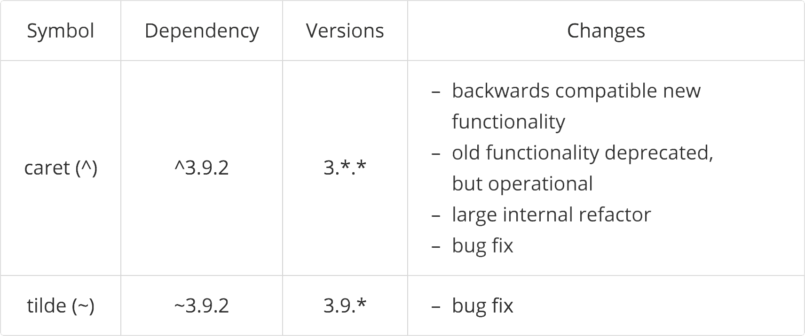

### Desenvolvimento Web com

{width=30%}

---

### O que vamos aprender

- **Criar projetos(npm init)**
- **Scripts Node**
- **Instalar pacotes**
- **Ler dados do console**

---

### Cria pacotes

---

### Packages Version

Semantic Verion

---

### Packages Version

---

### Licenças de Software

{width=60%}

https://choosealicense.com/licenses/

---

### Bhaskara

---

### Ler dados do console

---

### Versões de NPM

---

### Dúvidas?

{ width=90% }
