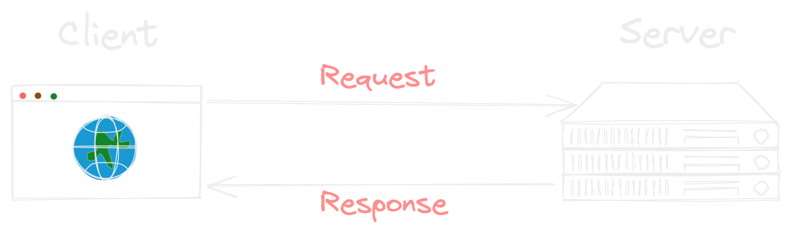
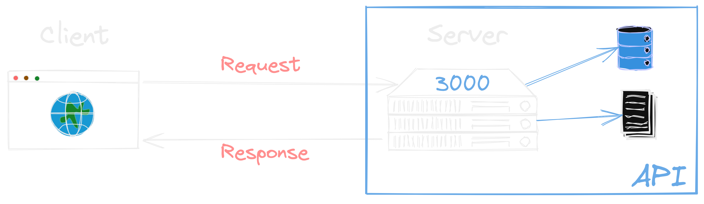

### Nossa primeira API

{width=65%}

---

### O que vamos aprender

- **Revisar requisições**
- **Postman**
- **O que é uma API?**
- **O tal do Express**
- **Criando as rotas**
- **implementando nosso 1º CRUD**

---

#### Revisão sobre as tais requisições

---

### O que é uma API

---

### Cria a nossa API

{width=60%}

---

### Nodemon

{width=80%}

---

### Estrutura da nossa API

{width=20%}

[Detalhes de o que vamos construir](./images/estrutura_api.png)

---

### Dúvidas?

{ width=90% }
